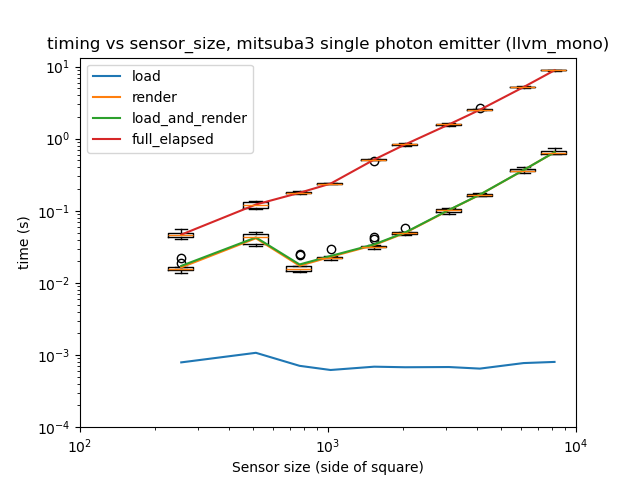
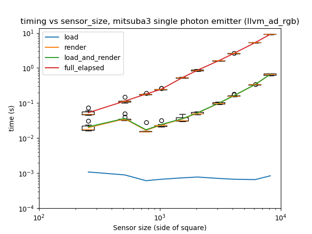
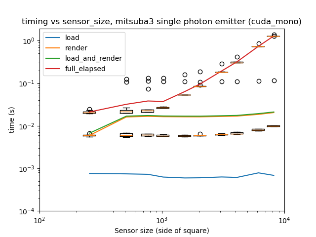
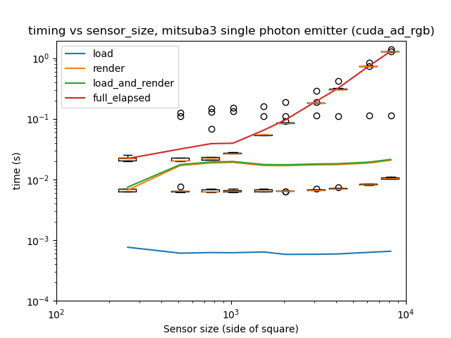
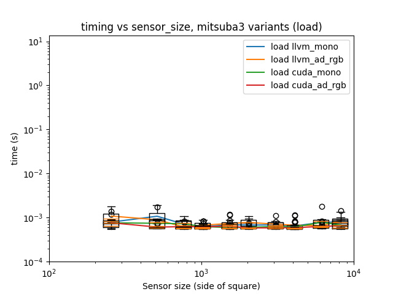
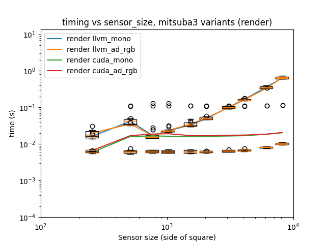
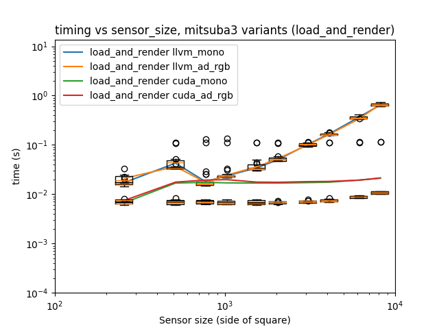
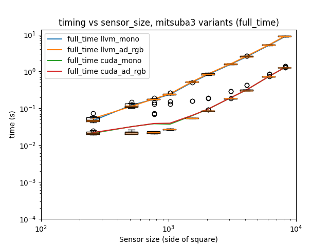

# Experiments to test performance and scaling with sensor size

## Background / Method

This is similar to experiment 01, but the parameter that is changed this time is the size of the (square) sensor, and the number of photons is kept constant at $10^7$. The size is increased in roughly powers of 2 from $256 * 256$ up to $8192 * 8192$.

In this particular instance, it is also possible to load a single `scene_description` at the start of a testing run, and then modify the size of the sensor by modifying the `params = mi.traverse(scene)` function and then calling `params.update()`, rather than having to call `mi.load_dict(..)` on every run.  [Note: there does appear to be some kind of memory issue or leak associated with this function, so being able to update the parameters without having to call it allowed me to increase the size of the sensor more than I originally thought possible.]

The experimental setup is otherwise identical (creating a Cherenkov ring) as experiment 01.

## Results

Results were obtained for both CPU and GPU nodes on the HEP cluster (see experiment 01 for details of these nodes).

All PNGs and CSVs created when running this experiment can be found in the `experiment_03` directory at the level of this file.

Averaged timing results for running the `llvm_mono`, `llvm_ad_rgb`, `cuda_mono` and `cuda_ad_rgb` variants are shown below.

Comparing the results for each step in Mitsuba3 across variants is shown below.

The "load step" in this instance is simply the time taken to modify the parameters for the sensor size and update the scene.

The results show an appreciable difference between the CPU and GPU behaviour when increasing the sensor size - whereas the GPU behaviour is roughly flat like we might expect to see, the CPU behaviour (particularly on the rendering step) does increase with sensor size.

Another thing to note here is that initial runs at a particular size (the first two runs, from what I have seen) are slower than any subsequent runs; I would suggest that this is possibly due to DrJit's kernel re-use, though I am not yet entirely convinced by this.  This may play some kind of role in any future implementations; it is often the case with GPUs in particular that some sort of "burn-in" period (i.e. by "priming" the GPU with a simpler run ahead of the main run) may be a good idea.  [Note: this is certainly the case on other projects I have been involved in; in those we were more concerned about running in real-time and so priming any GPU work in advance was necessary in order for there not to be any slowdown during any necessary real-time steps using the GPU].

## Conclusions and future work

This would agree with our conclusions from profiling the code where we saw that (on CPU) the size of the kernels on which DrJit was working during the rendering steps was equivalent to the size of the sensor.  This also shows that the GPU speedup is reasonably appreciable for larger sensor sizes. 
