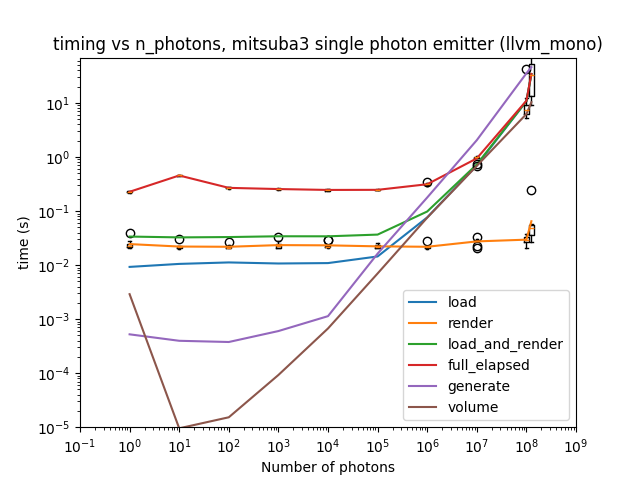
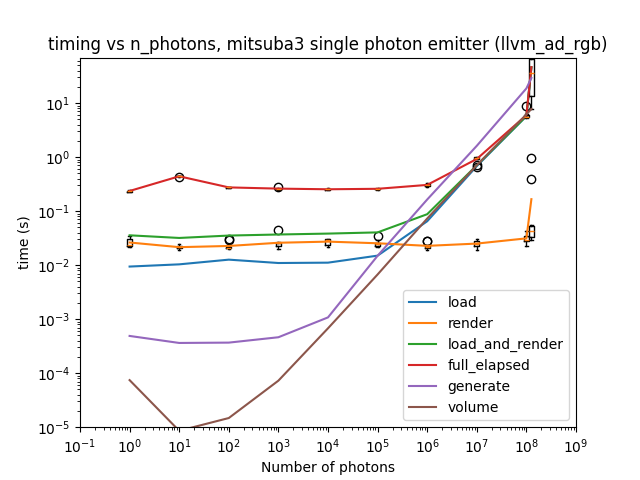
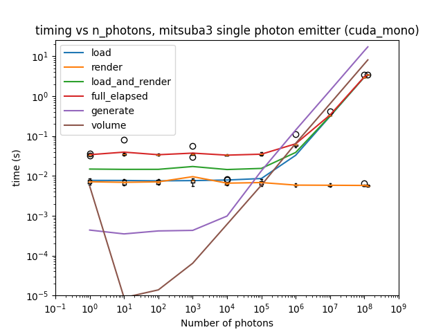
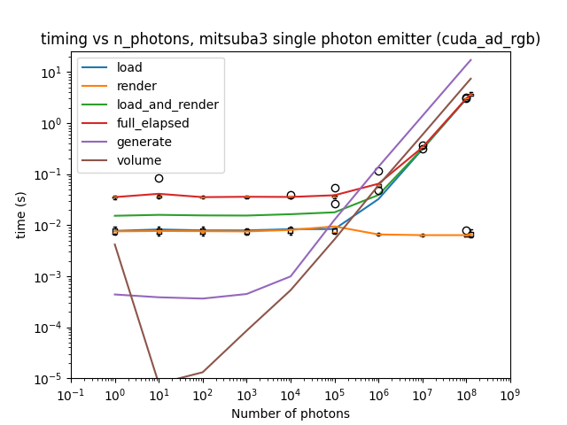
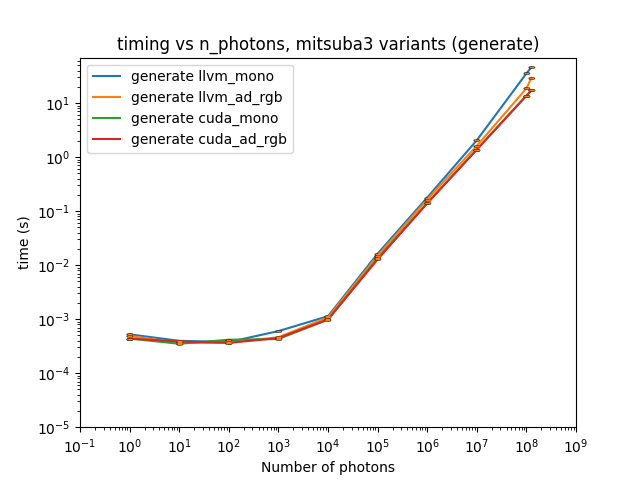
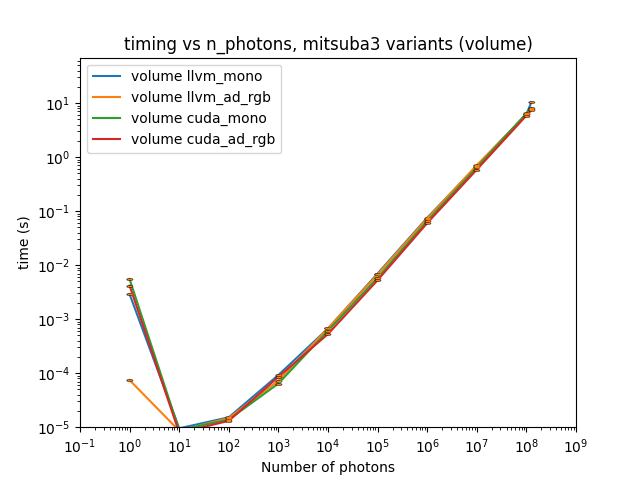
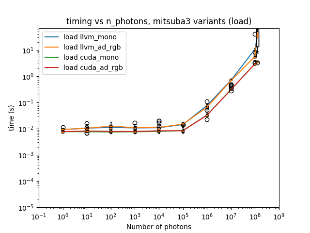
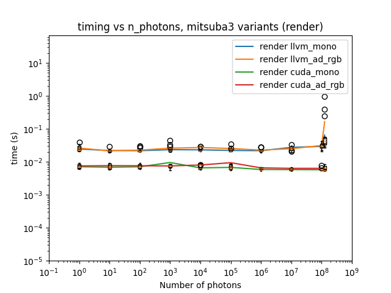
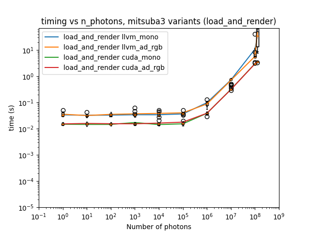
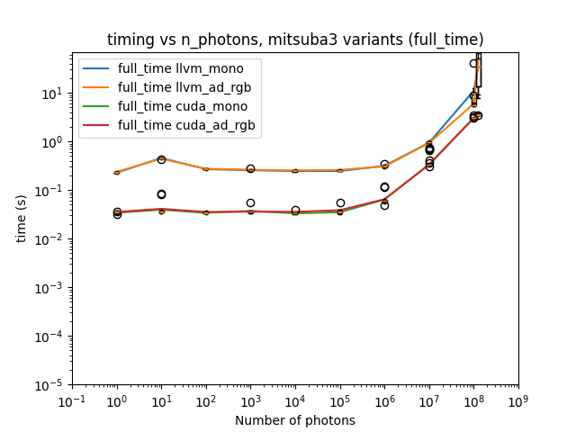

# Add a step to measure generation steps in experiment 01

## Background / Method

This is a repeat of experiment_01, but with timing measurements for the calls to `generate_emitter_data(...)` (which converts "Geant4" photons into a `numpy` object that can be understood by Mitsuba3), and the call to `mi.VolumeGrid(...)` which takes the result of the generated data and creates a `VolumeGrid` Mitsuba3 code object that can then be placed into a Mitsuba3 scene.

## Results

Results were obtained on both the CPUs and GPUs of the Noether HEP cluster, details of which can be found in experiment 01's write-up.

All timing PNGs and CSVs created for this experiment can be found in the `experiment_04` directory at the level of this file.

Averaged timing results for running `cuda_mono`, `cuda_rgb`, `llvm_mono` and `llvm_ad_rgb` variants are shown below.

Comparing the results for each step in Mitsuba3 across variants is shown below.

This shows that, for larger numbers of photons, both the generate and volume creation steps have similar times to generate compared to the loading step of the dictionary file / scene objects.  It also shows that these steps both scale linearly with the number of photons, suggesting that perhaps there is an element of "rendering" (e.g. possibly "ray-tracing") that is performed at this stage rather than during the rendering step later on in the experiment script.

## Conclusions and future work

The time taken for both the generate and volume steps is proportional to the number of photons (unlike the actual `mi.render(scene)` step).  It is therefore worth investigating whether or not what happens inside the creation of the `VolumeGrid` code object contains any steps which could be understood to be "rendering" the photonic rays.

