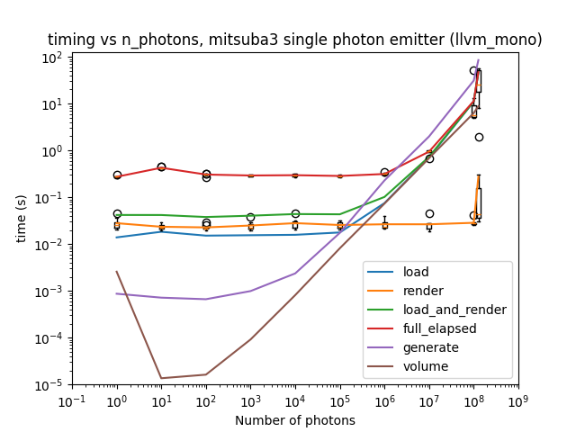
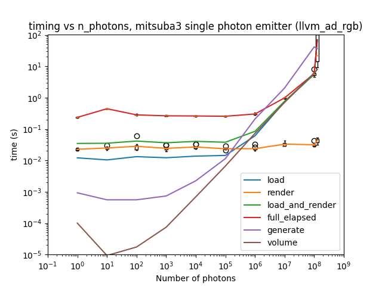
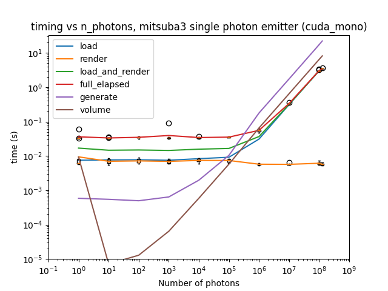
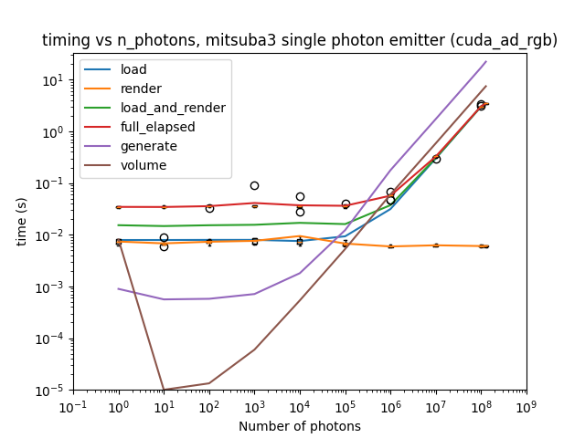
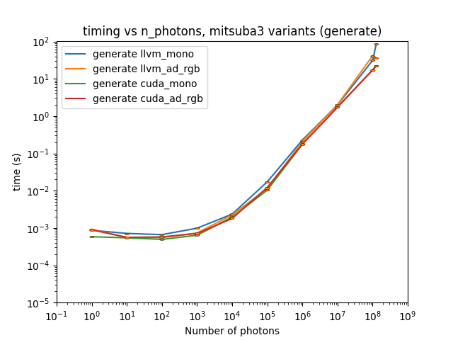
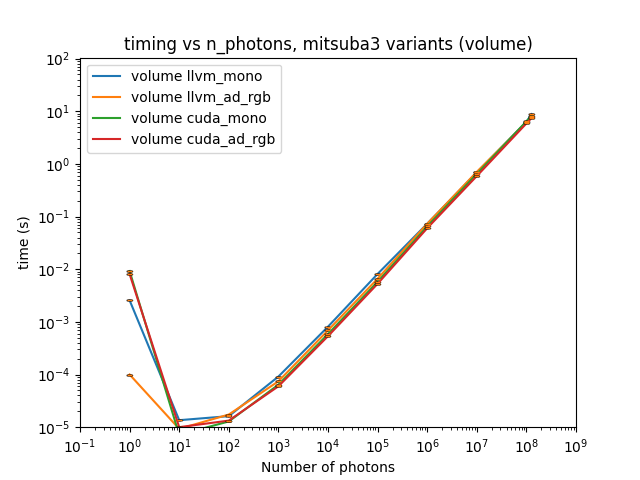
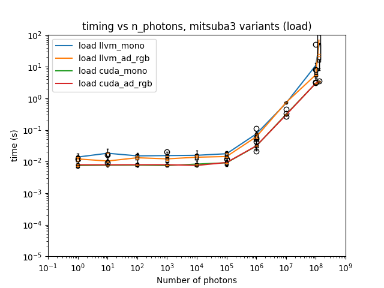
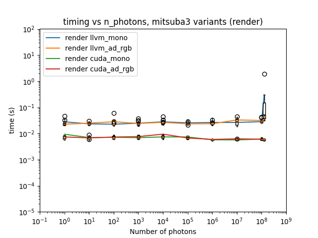
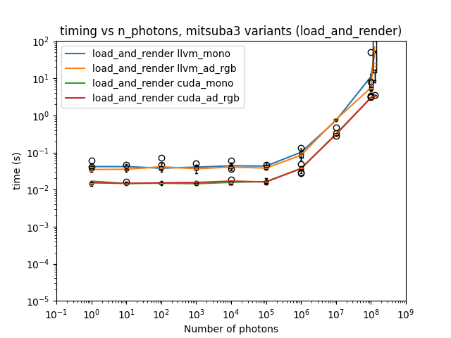
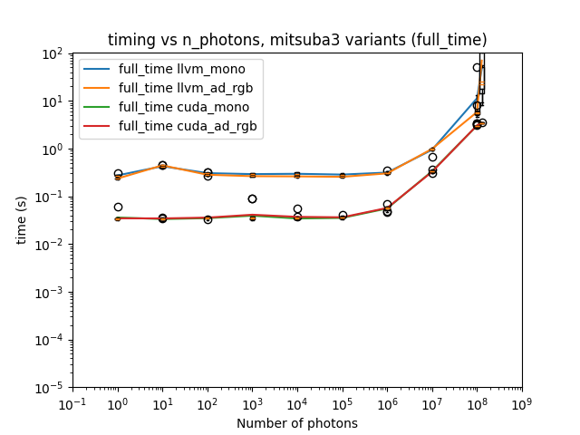

# Repeat experiment 04, but with rotations applied to initial data

## Background / Method

This is a repeat of experiment_04, but rather than repeating the initial photon data in order to run large numbers of photons, each repeat adds a small rotation to the initial photon data and then appends that to a set of data starting from the initial photon data.  This was done in order to avoid repeated data / ray paths where possible, which may tell us whether Mitsuba / Dr.Jit are doing something clever when repeated data / ray paths are discovered prior or during the rendering step.

The code changes required to do this are on a new branch, but not (yet) merged into `dev`, with the name `rotate_input_photons`.

## Results

Results were obtained on both the CPUs and GPUs of the Noether HEP cluster, details of which can be found in experiment_01's write-up.

All timing PNGs and CSVs created for this experiment can be found in the `experiment_05` directory at the level of this file.

Averaged timing results for running `cuda_mono`, `cuda_rgb`, `llvm_mono` and `llvm_ad_rgb` variants are shown below.

Comparing the results for each step in Mitsuba3 across variants is shown below.

This does not appear to make any difference to the previous results observed in experiment 04.

However, I do note that there appears to be an observable slowdown in the render step in the LLVM variants (i.e. when using CPU).  The largest value of n_photons here is chosen because it is close to the memory limits of the nodes available on the HEP Noether cluster; it seems to me that it will be worth investigating running this on the central CSF facility at the University of Manchester, where there are larger nodes available.

## Conclusions and future work

Some investigation of larger numbers of photons would appear to be required - this will likely require access to the CSF.
