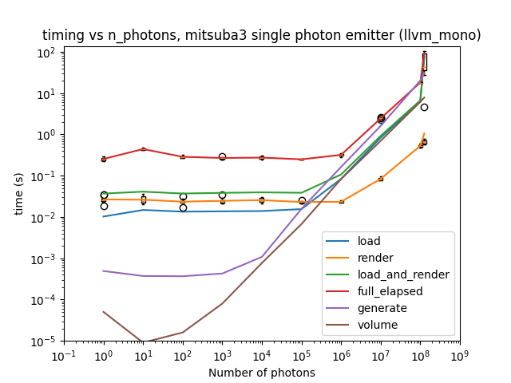
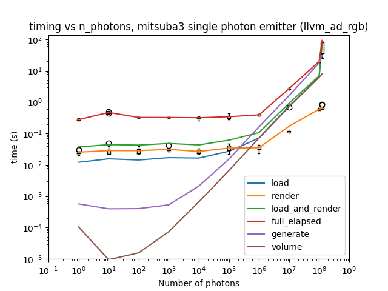
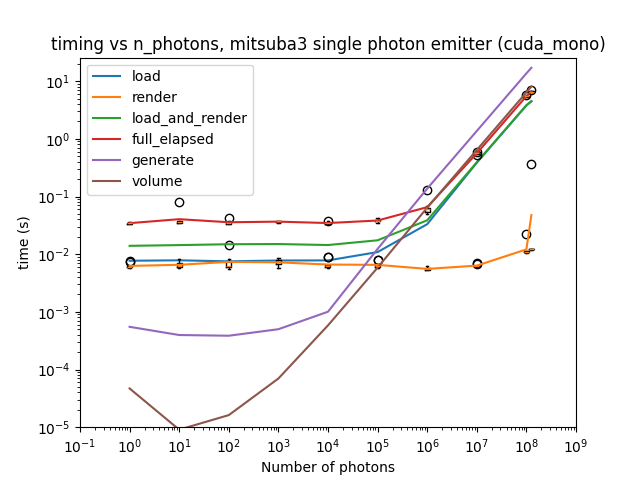
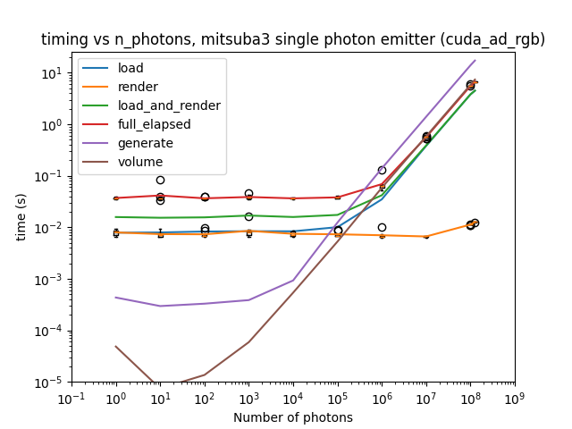
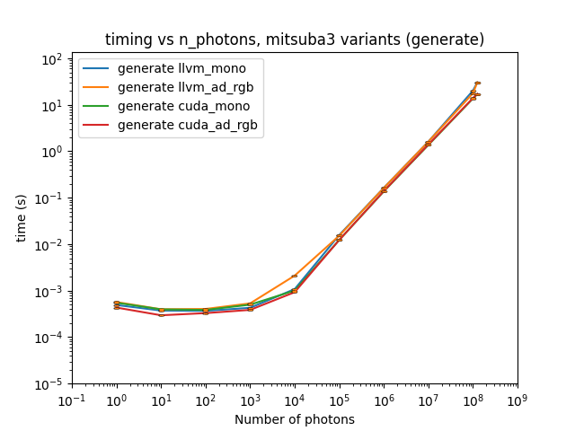
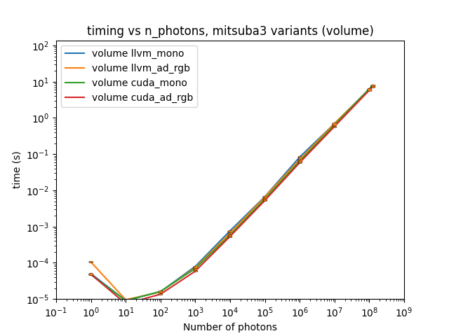
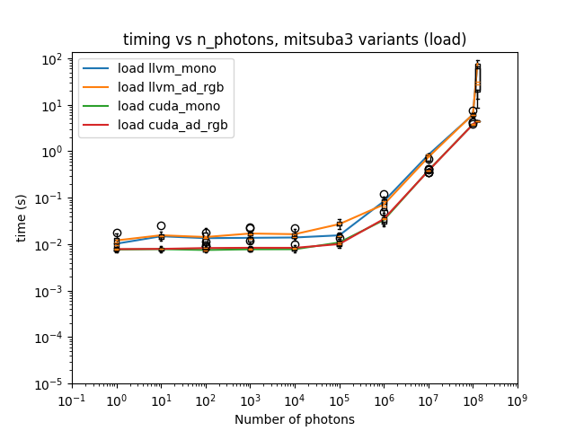
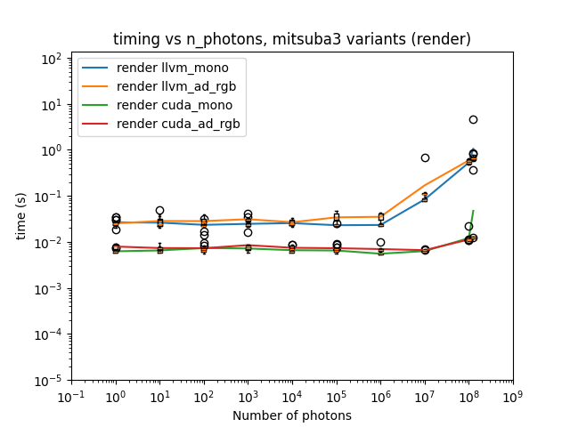
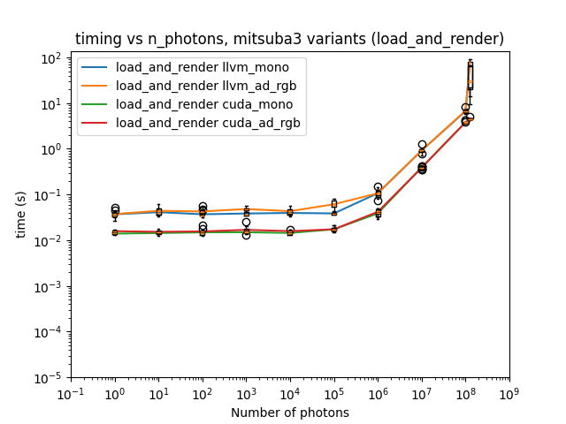
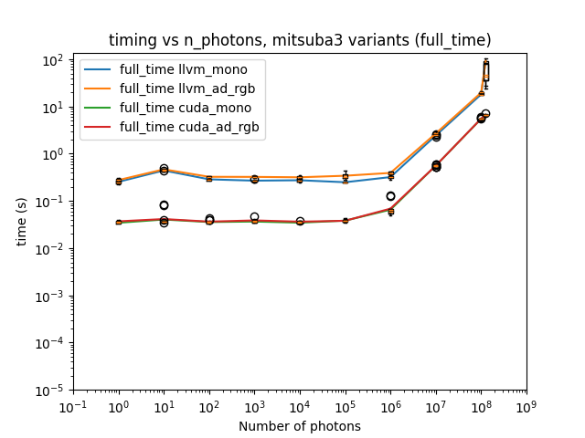

# Repeat experiment 04, but with rotations applied to initial data

## Background / Method

This is a repeat of experiment_04, but updating the `sample_count` parameter in the sensor so that the number of photons sampled is the same as the number of photons in the list (note: work is ongoing to understand whether in fact the "random" sampling does sample all the photons in the list or not).  The amount of sampling done by Mitsuba3 is solely dependent on this `sample_count` parameter and the size of the sensor, so the calculation to work out the `sample_count` is as follows:

${sample}\_{count} = math.ceil(n_{photons} / (s_{width} * s_{height}))$

So if $n_{photons}=10^8$ and the sensor is 1024x1024 pixels, then ${sample}\_{count}=96$. If $n_{photons} < (s_{width} * s_{height}$ then ${sample}\_{count}=1$, which will not qualitatively change previous results; this will only have any affect where $n_{photons} > (s_{width} * s_{height}$.

This uses more memory than previous versions, but I am still able to run with $n_{repeats}=135$, with the caveat that in the GPU cases, I see the following warning(s):

```
jit_flush_malloc_cache(): Dr.Jit exhausted the available memory and had to flush its allocation cache to free up additional memory. This is an expensive operation and will have a negative effect on performance. You may want to change your computation so that it uses less memory. This warning will only be displayed once.
```

This suggests that we may need to consider more carefully what happens with large numbers of photons to try to avoid this (it could, for example, be the case that this is caused simply by our experimental design of running multiple jobs one after the other and Dr.Jit's method caching).

## Results

Results were obtained on both the CPUs and GPUs of the Noether HEP cluster, details of which can be found in experiment_01's write-up.

All timing PNGs and CSVs created for this experiment can be found in the `experiment_06` directory at the level of this file.

Averaged timing results for running `cuda_mono`, `cuda_rgb`, `llvm_mono` and `llvm_ad_rgb` variants are shown below.






Comparing the results for each step in Mitsuba3 across variants is shown below.








In particular, this does now show the beginnings of some scaling on the `render()` function when the number of photons is larger than the size of the sensor.  Some experiments (not shown) were also run to consider what happens at smaller sensor sizes, but no obvious difference was discerned at a smaller number of photons in these instances.  It may be the case that everything below a certain number of photons has a section of the `render()` code which dominates the timing values, and it is only possible to see any scaling for say $n_{photons} > 10^6$.  It is also now clearer that there are benefits to running with a GPU (the cuda variants) compared to a CPU (the llvm variants).

## Conclusions and future work

We need to understand whether the sampling method samples all the photons in the list or not.  Recent communication with Mitsuba3 developers suggests that in fact our `sample_ray()` method ignores the random sample and simply uniformly samples from the available photons, which suggests that, if it doesn't already, then it may be relatively straightforward to ensure that all available photons are sampled and tracked.

It may also be instructive to consider further work to better understand the memory warning messages that are currently being received.
