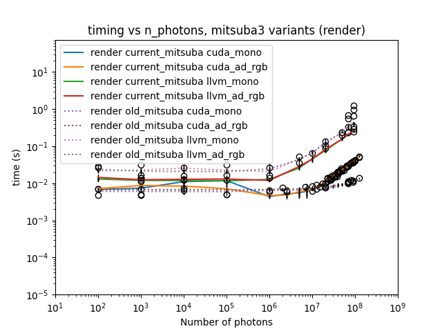
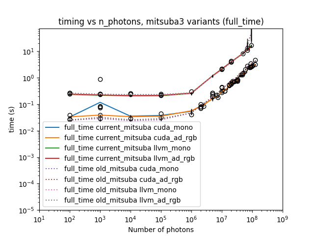

# Repeat experiment 04, but with rotations applied to initial data

## Background / Method

After updating the Manchester fork of Mitsuba to match changes in Mitsuba itself, it was noticed that the scaling behaviour seemed to have changed for larger numbers of photons.  This experiment was run to check whether this was the case; the same Mitsuba script (`single_emitter_test_new_change_nphotons.py`) was run using

- The "current" version of the Manchester fork (i.e. at `dev` at the date of writing, commit id `f840b27`)
- The "old" version of the Manchester fork around the time of previous experiments (commit id `ceb0e8f`)

Given the change in behaviour, it was also instructive to modify the script from previous experiments slightly so that more photon sizes were investigated in between $10^6$ and $10^8$ to obtain a better idea of what is now happening versus what was previously happening.

## Results

Results were obtained on both the CPUs and GPUs of the Noether HEP cluster, details of which can be found in experiment_01's write-up.

All timing PNGs and CSVs created for this experiment can be found in the `experiment_07` directory at the level of this file.

Comparing the results for the render step in Mitsuba3 across variants and Mitsuba versions ("current" as solid lines, "old" as dotted lines) is shown below.

Similarly for the full time step:

This shows that there have been changes in Mitsuba that have directly affected our particular experiment.  From reading the more recent updates, it seems as though the most recent work has been targeting Apple Silicon through a new Metal backend (see e.g. https://drjit.readthedocs.io/en/latest/changelog.html#drjit-1-4-0-june-25-2026), so it may be that this has had some effect on behaviour when running on other backends (as we do).

## Conclusions and future work

The current behaviour is perhaps more what we would have expected to see (i.e. some scaling once the number of photons is large enough) compared to what we were seeing (effectively very little or no scaling at all when change the number of photons). It may be worth asking the Mitsuba developers for their opinion/input on this.

However, I note too that even since I updated the Manchester fork a couple of months ago, there have been further updates to Mitsuba. In particular, the most recent update (version 3.9.0) mentions performance improvements in ray tracing and compilation in the release notes - see https://github.com/mitsuba-renderer/mitsuba3/releases#release-v3.9.0. So it may also be worth updating and testing again with these new changes to see if they have any effect on our experiment.