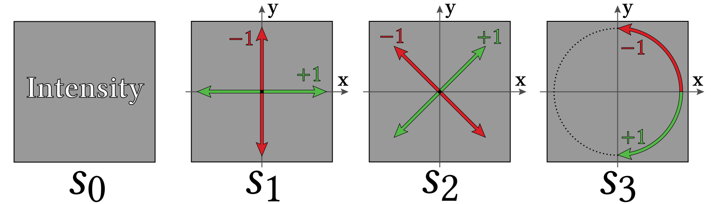
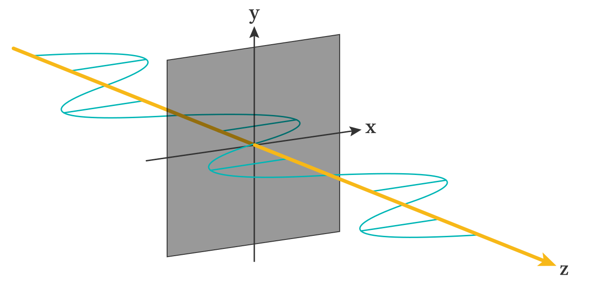
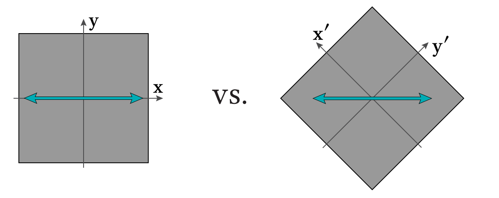
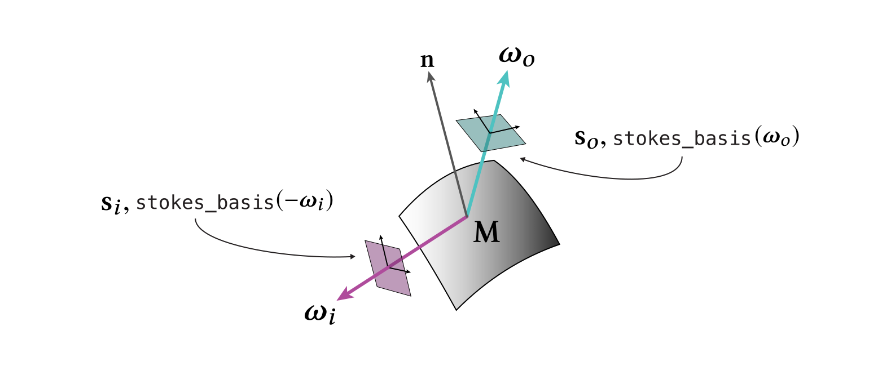
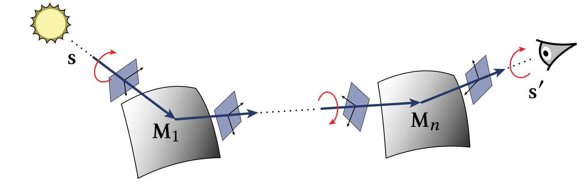

.. _developer_guide-polarization:

Polarization
==========================

When run in *polarized* rendering modes (e.g. `scalar_spectral_polarized`) Mitsuba 2 will track the full polarization state of light during a simulation. This state is described using a 4-dimensional quantity known as the *Stokes vector* :math:`\mathbf{s} = [s_0, s_1, s_2, s_3]`, which parameterizes the elliptical shape of the associated transverse oscillation :cite:`Collett1993PolarizedLight`.

- :math:`s_0` is equivalent to radiance and does not carry information about polarization.
- :math:`s_1` distinguishes horizontal vs. vertical linear polarization, where :math:`s_1 = \pm 1` stand for completely horizontally or vertically polarized light respectively.
- :math:`s_2` is similar to :math:`s_1` but distinguishes "diagonal" linear polarization at 45 degree angles.
- :math:`s_3` distinguishes right vs. left circular polarization, where :math:`s_3 = \pm 1` stand for fully right or left circularly polarized light respectively.
- Physically plausible stokes vectors need to fulfill :math:`s_0 \ge \sqrt{s_1^2 + s_2^2 + s_3^2}`.

Note that this information has to be tracked separately per wavelength.

A crucial detail here is the reference coordinate system (or frame) that is chosen to perform these "measurements". As long as it is orthogonal to the beam of light, this is purely a matter of convention. Mitsuba 2 follows the standard textbook description of polarization and chooses a right-handed coordinate system where the z-axis is along the light propagation direction like so:

In other words, when describing the polarization state using a Stokes vector, we look "into" the beam of light from the sensor side.
The horizontally polarized light (with :math:`\mathbf{s} = [1, 1, 0, 0]`) shown above is only described as such in this specific frame :math:`{\mathbf{x}, \mathbf{y}}`. It is completely equivalent to choose a different frame :math:`\mathbf{x}', \mathbf{y}'` and then the polarization state would be described with Stokes vector :math:`\mathbf{s} = [1, 0, -1, 0]` instead:

During rendering, light will of course also interact with matter which will generally affect its polarization state. This change is described by a *Mueller matrix* :math:`\mathbf{M} \in \mathbb{R}^{4\times4}`. After a reflection (or transmission), the incident (:math:`\mathbf{s}_i`) and outgoing (:math:`\mathbf{s}_o`) Stokes vectors are related by :math:`\mathbf{s}_o = \mathbf{M}\mathbf{s}_i`. This raises the same questions about reference frames as in the Stokes vector case, only that now *two* frames need to be defined for both incident and outgoing direction of the interaction:

(Note that here :math:`\omega_i` is assumed to point towards the light source, thus the frame needs to be constructed based on :math:`-\omega_i` which is along the flow of light.)

With Mueller matrices, the standard BSDF definition :math:`f_r(\lambda, \omega_i, \omega_o)` used in unpolarized rendering can be generalized to a polarized pBSDF :math:`\mathbf{M}(\lambda, \omega_i, \omega_o)`. Mitsuba 2 includes pBSDF implementation for conductors and dielectrics (following the polarized Fresnel equations), as well as standard optical elements such as linear polarizers and retarders.

Full light transport simulations with multiple interactions complicate things even further. Multiplications of subsequent Mueller matrices along a light path are only meaningful, if their reference frames match at this connection. In practice, additional coordinate rotations (red arrows in Figure below) are necessary to ensure this.

Luckily, such a frame rotation can itself be expressed with a simple Mueller matrix. In Mitsuba 2, sampling or evaluation routines of pBSDFs always return matrices that are already pre-rotated on both ends to align with the desired incident and outgoing directions to make this process simpler.

A last important detail in polarized rendering is the question of reciprocity. Unfortunately, pBSDFs generally do not follow *Helmholtz reciprocity* like standard BSDFs do, and are only defined along the direction of light. This complicates the implementation of some (e.g. bidirectional) rendering techniques slightly :cite:`Jarabo2018BidirectionalPol` :cite:`Mojzik2016BidirectionalPol`:

- When tracing radiance emitted from the light sources (e.g. in a light tracer), everything follows the standard flow of light. Here, the simulation can simply track Stokes vectors instead of radiance and perform the necessary Mueller matrix multiplications.
- When tracing importance "emitted" from sensors (e.g. in a path tracer), things are reversed and we need to track the (Mueller matrix valued) throughput from the sensor side. Additional care is needed in order to apply the right order of operations when multiplying Mueller matrices at the encountered surfaces here.
