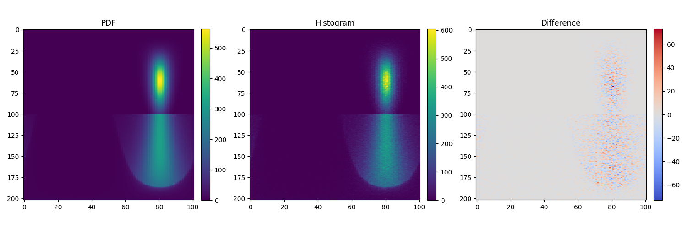

Testing
=======

To run the test suite, simply invoke ``pytest``:

.. code-block:: bash

    pytest

    # or to run a single test file
    pytest src/bsdfs/tests/test_diffuse.py

Note that running the full test suite can take a long time, especially on machines
with less cores. It is possible to skip the execution of the slower tests in the
following way:

.. code-block:: bash

    pytest -m 'not slow'

The build system also exposes a ``pytest`` target that executes ``setpath`` and
parallelizes the test execution.

.. code-block:: bash

    ninja pytest

Chi^2 tests
-----------

The ``mitsuba.python.chi2`` module implements the Pearson's chi-square test for
testing goodness of fit of a distribution to a known reference distribution.

The implementation specifically compares a Monte Carlo sampling strategy on a
2D (or lower dimensional) space against a reference distribution obtained by
numerically integrating a probability density function over grid in the
distribution's parameter domain.

This is used extensively throughout the test suite to valid the implementation
of ``BSDFs``, ``Emitters``, and other sampling code.

It is possible to test your own sampling code in the following way:

.. code-block:: python

    import mitsuba
    mitsuba.set_variant('packet_rgb')

    from mitsuba.python.chi2 import ChiSquareTest, SphericalDomain

    # some sampling code
    def my_sample(sample):
        return mitsuba.core.warp.square_to_cosine_hemisphere(sample)

    # the corresponding probability density function
    def my_pdf(p):
        return mitsuba.core.warp.square_to_cosine_hemisphere_pdf(p)

    chi2 = ChiSquareTest(
        domain=SphericalDomain(),
        sample_func=my_sample,
        pdf_func=my_pdf,
        sample_dim=2
    )

    assert chi2.run()

In case of failure, the target density and histogram were written to
``chi2_data.py`` which can simply be run to plot the data:

.. code-block:: bash

    python chi2_data.py

The ``mitsuba.python.chi2`` module also provides a set of ``Adapter`` functions
which can be used to wrap different plugins (e.g. ``BSDF``, ``Emitter``, ...)
in order to test them:

.. code-block:: python

    import mitsuba
    import enoki as ek

    mitsuba.set_variant('packet_rgb')

    from mitsuba.python.chi2 import BSDFAdapter, ChiSquareTest, SphericalDomain

    xml = """<float name="alpha" value="0.5"/>
             <boolean name="sample_visible" value="false"/>
             <string name="distribution" value="ggx"/>
          """
    wi = ek.normalize([0.2, -0.6, -0.5])
    sample_func, pdf_func = BSDFAdapter("roughdielectric", xml, wi=wi)

    chi2 = ChiSquareTest(
        domain=SphericalDomain(),
        sample_func=sample_func,
        pdf_func=pdf_func,
        sample_dim=3
    )

    assert chi2.run()

    # Forces the chi2 test to dump the plotting script (optional)
    chi2._dump_tables()

Here is the figure generated by the ``chi2_data.py`` script from the example above:

The plot on the left shows the density function generated by numerically
integrating the analytical ``pdf()`` method of a ``roughdielectric`` BSDF with
an incoming vector coming from inside. Most of the energy leaves the surface
(upper half of the plot) while some energy gets reflected back inside the
surface (lower half of the plot).

The middle plot shows the same density function but this time computed as a
histogram of sampled directions resulting from the ``sample()`` method of the
``roughdielectric`` BSDF.

The right plot shows the difference between the two density functions. The
sampling routine of the BSDF being stochastic, it is expected to see a mix of
negative and positive values as the histogram is still noisy. The main role of
the ``ChiSquareTest`` is to decide whether the observed deviation is within the
range of random noise, or whether there are systematic biases that should lead
to a test failure.

For more information, see :py:class:`mitsuba.python.chi2.ChiSquareTest`.

Rendering test suite and Z-test
---------------------------------------

On top of test *unit tests*, the framework implements a mechanism that automatically renders a set
of test scenes and applies the `Z-test <https://en.wikipedia.org/wiki/Z-test>`_ to compare the
resulting images and some reference images.

Those tests are really useful to reveal bugs at the interaction between the individual
components of the renderer.

The test scenes are rendered using all the different enabled variants of the renderer, ensuring for
instance that the ``scalar_rgb`` renders match the ``gpu_rgb`` renders.

To only run the rendering test suite, use the following command:

.. code-block:: bash

    pytest src/librender/tests/test_renders.py

One can easily add a scene to the ``resources/data/tests/scenes/`` folder to add it to the rendering
test suite. Then, the missing reference images can be generated using the following command:

.. code-block:: bash

    python src/librender/tests/test_renders.py