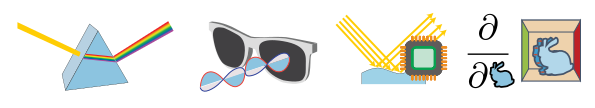

Getting started
===============

Mitsuba 2 is a research-oriented rendering system written in portable C++17. It
consists of a small set of core libraries and a wide variety of plugins that
implement functionality ranging from materials and light sources to complete
rendering algorithms. Mitsuba 2 strives to retain scene compatibility with its
predecessor `Mitsuba 0.6 <https://github.com/mitsuba-renderer/mitsuba>`_.
However, in most other respects, it is a completely new system following a
different set of goals.

The most significant change of Mitsuba 2 is that it is a *retargetable*
renderer: this means that the underlying implementations and data structures
are specified in a generic fashion that can be transformed to accomplish a
number of different tasks. For example:

1. In the simplest case, Mitsuba 2 is an ordinary CPU-based RGB renderer that
   processes one ray at a time similar to its predecessor `Mitsuba
   0.6 <https://github.com/mitsuba-renderer/mitsuba>`_.

2. Alternatively, Mitsuba 2 can be transformed into a differentiable renderer
   that runs on NVIDIA RTX GPUs. A differentiable rendering algorithm is able
   to compute derivatives of the entire simulation with respect to input
   parameters such as camera pose, geometry, BSDFs, textures, and volumes. In
   conjunction with gradient-based optimization, this opens door to solving challenging
   inverse problems including computational material design and scene reconstruction.

3. Another type of transformation turns Mitsuba 2 into a vectorized CPU
   renderer that leverages Single Instruction/Multiple Data (SIMD) instruction
   sets such as AVX512 on modern CPUs to efficiently sample many light paths in
   parallel.

4. Yet another type of transformation rewrites physical aspects of the
   simulation: Mitsuba can be used as a monochromatic renderer, a RGB-based
   renderer, or as a spectral renderer. Each variant can optionally account for
   the effects of polarization if desired.

In addition to the above transformations, there are several other noteworthy
changes:

1. Mitsuba 2 provides very fine-grained Python bindings to essentially every
   function using `pybind11 <https://github.com/pybind/pybind11>`_. This makes
   it possible to import the renderer into a Jupyter notebook and develop new
   algorithms interactively while visualizing their behavior using plots.

2. The renderer includes a large automated test suite written in Python, and
   its development relies on several continuous integration servers that
   compile and test new commits on different operating systems using various
   compilation settings (e.g. debug/release builds, single/double precision,
   etc). Manually checking that external contributions don't break existing
   functionality had become a severe bottleneck in the previous Mitsuba 0.6
   codebase, hence the goal of this infrastructure is to avoid such manual
   checks and streamline interactions with the community (Pull Requests, etc.)
   in the future.

3. An all-new cross-platform user interface is currently being developed using
   the `NanoGUI <https://github.com/mitsuba-renderer/nanogui>`_ library. *Note
   that this is not yet complete.*

About
--------------

This project was created by `Wenzel Jakob <http://rgl.epfl.ch/people/wjakob>`_.
Significant features and/or improvements to the code were contributed by
`Merlin Nimier-David <https://merlin.nimierdavid.fr/>`_,
`Guillaume Loubet <https://maverick.inria.fr/Membres/Guillaume.Loubet/>`_,
`Sébastien Speierer <https://github.com/Speierers>`_,
`Benoît Ruiz <https://github.com/4str0m>`_,
`Delio Vicini <https://dvicini.github.io/>`_,
and `Tizian Zeltner <https://tizianzeltner.com/>`_.

