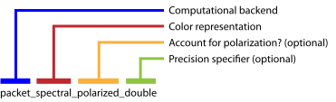
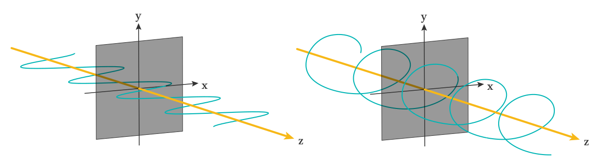

.. _sec-variants:

Choosing variants
=================

Mitsuba 2 is a retargetable rendering system that provides a set of different
system "*variants*" that change elementary aspects of simulation---they can for
instance replace the representation of color to support monochromatic, RGB,
spectral, or even polarized illumination. Similarly, the numerical
representation underlying the simulation can be exchanged to perform renderings
using a higher amount of precision, vectorization to process many light paths
at once, or it can be mathematically differentiated to to solve inverse
problems. All variants are automatically created from a single generic codebase.

As many as 36 different variants of the renderer are presently available, shown
in the list below. Before building Mitsuba 2, you will therefore need to decide
which of these are relevant for your intended application.

  .. container:: toggle

      .. container:: header

          **Show/hide available variants**

      - :monosp:`scalar_mono`
      - :monosp:`scalar_mono_double`
      - :monosp:`scalar_mono_polarized`
      - :monosp:`scalar_mono_polarized_double`
      - :monosp:`scalar_rgb`
      - :monosp:`scalar_rgb_double`
      - :monosp:`scalar_rgb_polarized`
      - :monosp:`scalar_rgb_polarized_double`
      - :monosp:`scalar_spectral`
      - :monosp:`scalar_spectral_double`
      - :monosp:`scalar_spectral_polarized`
      - :monosp:`scalar_spectral_polarized_double`
      - :monosp:`packet_mono`
      - :monosp:`packet_mono_double`
      - :monosp:`packet_mono_polarized`
      - :monosp:`packet_mono_polarized_double`
      - :monosp:`packet_rgb`
      - :monosp:`packet_rgb_double`
      - :monosp:`packet_rgb_polarized`
      - :monosp:`packet_rgb_polarized_double`
      - :monosp:`packet_spectral`
      - :monosp:`packet_spectral_double`
      - :monosp:`packet_spectral_polarized`
      - :monosp:`packet_spectral_polarized_double`
      - :monosp:`gpu_mono`
      - :monosp:`gpu_mono_polarized`
      - :monosp:`gpu_rgb`
      - :monosp:`gpu_rgb_polarized`
      - :monosp:`gpu_spectral`
      - :monosp:`gpu_spectral_polarized`
      - :monosp:`gpu_autodiff_mono`
      - :monosp:`gpu_autodiff_mono_polarized`
      - :monosp:`gpu_autodiff_rgb`
      - :monosp:`gpu_autodiff_rgb_polarized`
      - :monosp:`gpu_autodiff_spectral`
      - :monosp:`gpu_autodiff_spectral_polarized`

Note that compilation time and compilation memory usage is roughly proportional
to the number of enabled variants, hence including many of them (more than
five) may not be advisable. Mitsuba 2 developers will typically want to
restrict themselves to 1-2 variants used by their current experiment to
minimize edit-recompile times. Each variant is associated with an identifying
name that is composed of several parts:

We will now discuss each part in turn.

Part 1: Computational backend
-----------------------------

The computational backend controls how basic arithmetic operations like
additions or multiplications are realized by the system. The following choices
are available:

- The ``scalar`` backend performs computation on the CPU using normal floating
  point arithmetic similar to older versions of Mitsuba. This is the default
  choice for generating renderings using the :monosp:`mitsuba` command line
  executable, or using the graphical user interface.

- The ``packet`` backend efficiently performs calculations on groups of 4, 8,
  or 16 floating point numbers, exploiting instruction set extensions such as
  SSE4.2, AVX, AVX2, and AVX512. In packet mode, every single operation in a
  rendering algorithm (ray tracing, BSDF sampling, etc.) will therefore operate on
  multiple inputs at once. The following visualizations of tracing light
  paths in scalar and packet mode gives an idea of this difference:

  .. image:: ../../../resources/data/docs/images/variants/vectorization.jpg
      :width: 100%
      :align: center

  Note, however, that packet mode is not a magic bullet: standard algorithms
  won't automatically be 8 or 16x faster. Packet mode requires special
  algorithms and is intended to be used by developers, whose software can
  exploit this type of parallelism.

- The ``gpu`` backend offloads computation to the GPU using `Enoki's
  <https://github.com/mitsuba-renderer/enoki>`_ just-in-time (JIT) compiler
  that transforms computation into CUDA kernels. Using this backend, each
  operation typically operates on millions of inputs at the same time. Mitsuba
  then becomes what is known as a *wavefront path tracer* and delegates ray
  tracing on the GPU to NVIDIA's OptiX library. Note that this requires a
  relatively recent NVIDIA GPU: ideally *Turing* or newer. The older *Pascal*
  architecture is also supported but tends to be slower because it lacks ray
  tracing hardware acceleration.

- Building on the ``gpu`` backend, ``gpu_autodiff`` furthermore propagates
  derivative information through the simulation, which is a crucial ingredient
  for solving *inverse problems* using rendering algorithms.

  The following shows an example from :cite:`NimierDavidVicini2019Mitsuba2`.
  Here, Mitsuba 2 is used to compute the height profile of a transparent glass
  panel that refracts red, green, and blue light in such a way as to reproduce
  a specified color image.

  .. image:: ../../../resources/data/docs/images/autodiff/caustic.jpg
      :width: 100%
      :align: center

  The main use case of the ``gpu_autodiff`` backend is *differentiable
  rendering*, which interprets the rendering algorithm as a function
  :math:`f(\mathbf{x})` that converts an input :math:`\mathbf{x}` (the scene
  description) into an output :math:`\mathbf{y}` (the rendering). This function
  :math:`f` is then mathematically differentiated to obtain
  :math:`\frac{\mathrm{d}\mathbf{y}}{\mathrm{d}\mathbf{x}}`, providing a
  first-order approximation of how a desired change in the output
  :math:`\mathbf{y}` (the rendering) can be achieved by changing the inputs
  :math:`\mathbf{x}` (the scene description). Together with a differentiable
  *objective function* :math:`g(\mathbf{y})` that quantifies the suitability of
  tentative scene parameters and a gradient-based optimization algorithm, a
  differentiable renderer can be used to solve complex inverse problems
  involving light.

  .. image:: ../../../resources/data/docs/images/autodiff/autodiff.jpg
      :width: 100%
      :align: center

  The documentations provides several applied examples on :ref:`differentiable
  and inverse rendering <sec-inverse-rendering>`.

An appealing aspect of ``packet``, ``gpu``, and ``gpu_autodiff`` modes, is that
they expose *vectorized* Python interfaces that operate on arbitrarily large
set of inputs (even in the case of ``packet`` mode that works with smaller
arrays. The C++ implementation sweeps over larger inputs in this case). This
means that millions of ray tracing operations or BSDF evaluations can be
performed with a single Python function call, enabling efficient prototyping
within Python or Jupyter notebooks without costly iteration over many elements.

How to choose?
^^^^^^^^^^^^^^

We generally recommend compiling ``scalar`` variants for command line
rendering, and ``packet`` or ``gpu_autodiff`` variants for Python
development---the latter only if differentiable rendering is desired.

Part 2: Color representation
----------------------------

The next part determines how Mitsuba represents color information. The
following choices are available:

- ``mono`` completely disables the concept of color, which is useful when
  simulating scenes that are inherently monochromatic (e.g. illumination due to
  a laser). This mode is great for writing testcases where color is simply not
  relevant. When an input scene provides color information, :monosp:`mono` mode
  automatically converts it to grayscale.

- ``rgb`` mode selects an RGB-based color representation. This is a reasonable
  default choice and matches the typical behavior of the previous generation of
  Mitsuba. On the flipside, RGB mode can be a poor approximation of how color
  works in the real world. Please click on the following for a longer
  explanation.

    .. container:: toggle

        .. container:: header

            **Issues involving RGB-based rendering (click to expand)**

        **Problematic aspects of RGB-based color representations:** A RGB
        rendering algorithm frequently performs two color-related operations:
        component-wise addition to combine different sources of light, and
        component-wise multiplication of RGB color vectors to model
        interreflection. While addition is fine, RGB multiplication turns out
        to be a nonsensical operation, that can give very different answers
        depending on the underlying RGB color space.

        Suppose we are rendering a scene in an sRGB color space, where a green
        light with radiance :math:`[0, 0, 1]` reflects from a very green
        surface with albedo :math:`[0, 0, 1]`. The component-wise
        multiplication :math:`[0, 0, 1] \otimes [0, 0, 1] = [0, 0, 1]` tells us
        that no light is absorbed by the surface. So good so far.

        Let's now switch to a larger color space named *Rec. 2020*. That same
        green color is no longer at the extreme of the color gamut but lies
        somewhere inside.

        .. image:: ../../../resources/data/docs/images/variants/rgb-mode-issue.svg
            :width: 100%
            :align: center

        For simplicity, let's suppose it has coordinates :math:`[0, 0,
        \frac{1}{2}]`. Now, the same calculation :math:`[0, 0,
        \frac{1}{2}]\otimes[0, 0, \frac{1}{2}]=[0, 0, \frac{1}{4}]` tells us
        that half of the light is absorbed by the surface, which illustrates
        the problem with RGB multiplication. The solution to this problem is to
        multiply colors in the spectral domain instead.

- Finally, ``spectral`` mode switches to a fully spectral color representation
  spanning the visible range :math:`(360\ldots 830 \mathrm{nm})`. The
  wavelength domain is simply treated as yet another dimension of the space of
  light paths over which the rendering algorithm must integrate.

  This improves accuracy especially in scenarios where measured spectral data
  is available. Consider for example the two Cornell box renderings below: on
  the left side, the spectral reflectance data of all materials is first
  converted to RGB and rendered using the ``scalar_rgb`` variant, producing a
  deceivingly colorful image. In contrast, the ``scalar_spectral`` variant that
  correctly accounts for the spectral characteristics, produces a more muted
  coloration.

  .. subfigstart::
  .. subfigure:: ../../../resources/data/docs/images/render/variants_cbox_rgb.jpg
     :caption: RGB Mode
  .. subfigure:: ../../../resources/data/docs/images/render/variants_cbox_spectral.jpg
     :caption: Spectral Mode
  .. subfigend::
     :label: fig-cbox-spectral

  Note that Mitsuba still generates RGB output images by default even when
  spectral mode is active. It is also important to note that many existing
  Mitsuba scenes only specify RGB color information. Spectral Mitsuba can still
  render such scenes -- in this case, it determines plausible smooth spectra
  corresponding to the specified RGB colors :cite:`Jakob2019Spectral`.

Part 3: Polarization
--------------------

If desired, Mitsuba 2 can keep track of the full polarization state of light.
Polarization refers to the property that light is an electromagnetic wave that
oscillates perpendicularly to the direction of travel. This oscillation can
take on infinitely many different shapes---the following images show examples
of *horizontal* and *elliptical* polarization.

Because humans do not perceive polarization, accounting for it is usually not
necessary when rendering images that are intended to be look realistic.
However, polarization is easily observed using a variety of measurement devices
and cameras, and it tends to provide a wealth of information about the material
and shape of visible objects. For this reason, polarization is a powerful tool
for solving inverse problems, and this is one of the reasons why we chose to
support it in Mitsuba 2. Note that accounting for polarization comes at a
cost---roughly a 1.5-2X increase in rendering time.

Inside the light transport simulation, *Stokes vectors* are used to
parameterize the elliptical shape of the transverse oscillations, and *Mueller
matrices* are used to compute the effect of surface scattering on the
polarization :cite:`Collett1993PolarizedLight`. For more details regarding the
implementation of the polarized rendering modes, please refer to the
:ref:`developer_guide-polarization` section in the developer guide.

Part 4: Precision
-----------------

Mitsuba 2 normally relies on single precision (32 bit) arithmetic, but double
precision (64 bit) is optionally available. We find this particularly helpful
for debugging: whether or not an observed problem arises due to floating point
imprecisions can normally be determined after switching to double precision.
Note that double precision currently not available for ``gpu_*`` variants. This
is because OptiX performs ray tracing in single precision.

Configuring :monosp:`mitsuba.conf`
----------------------------------

Mitsuba 2 variants are specified in the file :monosp:`mitsuba.conf`. To get
started, first copy the default template to the root directory of the Mitsuba 2
repository.

.. code-block:: bash

    cd <..mitsuba repository..>
    cp resources/mitsuba.conf.template mitsuba.conf

Next, open :monosp:`mitsuba.conf` in your favorite text editor and scroll down
to the declaration of the enabled variants (around line 70):

.. code-block:: text

    "enabled": [
        # The "scalar_rgb" variant *must* be included at the moment.
        "scalar_rgb",
        "scalar_spectral"
    ],

The default file specifies two scalar variants that you may wish to extend
according to your requirements and the explanations given above. Note that
``scalar_spectral`` can be removed, but ``scalar_rgb`` *must* currently be part
of the list as some core components of Mitsuba depend on it. You may also wish
to change the *default* variant that is executed if no variant is explicitly
specified (this must be one of the entries of the ``enabled`` list):

.. code-block:: text

    # If mitsuba is launched without any specific mode parameter,
    # the configuration below will be used by default

    "default": "scalar_spectral",

The remainder of this file lists the C++ types defining the available variants
and can safely be ignored.

TLDR: If you plan to use Mitsuba from Python, we recommend adding one of
``packet_rgb`` or ``packet_spectral`` for CPU rendering, or one of
``gpu_autodiff_rgb`` or ``gpu_autodiff_spectral`` for differentiable GPU
rendering.

Once you are finished with :monosp:`mitsuba.conf`, proceed to the next section
on :ref:`compiling the system <sec-compiling>`.
