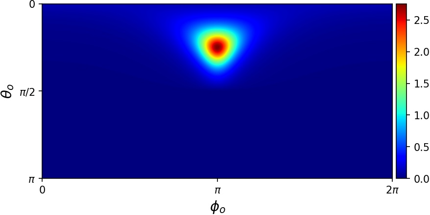

Evaluating a BSDF
=================

The Python API can also be used to interface with more low-level components
of the renderer directly, without rendering an image.
In this section for example, we instatiate a :ref:`bsdf-roughconductor`
BSDF plugin and evaluate it for some incident and outgoing direction pairs.

.. code-block:: python

    import enoki as ek
    import mitsuba

    # Set the desired mitsuba variant
    mitsuba.set_variant('packet_rgb')

    from mitsuba.render import SurfaceInteraction3f, BSDFContext
    from mitsuba.core.xml import load_string

    # Create unit directions from spherical coordinates
    def sph_dir(theta, phi):
        st, ct = ek.sincos(theta)
        sp, cp = ek.sincos(phi)
        return mitsuba.core.Vector3f(cp*st, sp*st, ct)

    # Load desired BSDF plugin
    bsdf = load_string("""<bsdf version='2.0.0' type='roughconductor'>
                              <float name="alpha" value="0.2"/>
                              <string name="distribution" value="ggx"/>
                          </bsdf>""")

    # Create a (dummy) surface interaction to use for the evaluation
    si = SurfaceInteraction3f()

    # Specify incident direction with 45 degrees elevation
    si.wi = sph_dir(ek.pi*45.0/180.0, 0.0)

    # Create a record that can carry additional information about the BSDF query
    ctx = BSDFContext()

    # Create large packet of outgoing directions from a grid in spherical coordinates
    res = 300
    theta_os = ek.linspace(ek.dynamic.Float32, 0, ek.pi, res)
    phi_os   = ek.linspace(ek.dynamic.Float32, 0, 2*ek.pi, 2*res)
    theta_o, phi_o = ek.meshgrid(theta_os, phi_os)
    wo = sph_dir(theta_o, phi_o)

    # Evaluate the whole packet (18000 directions) at once
    values = bsdf.eval(ctx, si, wo)
The generated array of values can then be further processed in NumPy or plotted with matplotlib:

.. code-block:: python

    import numpy as np
    import matplotlib.pyplot as plt
    from mpl_toolkits.axes_grid1 import make_axes_locatable

    # Extract red channel and bring data back into 2D grid
    values_r = np.array(values)[:,0]
    values_r = values_r.reshape(2*res, res).T

    # Plot values for spherical coordinates
    plt.figure()
    ax = plt.gca()

    im = ax.imshow(values_r, extent=[0, 2*np.pi, np.pi, 0], cmap='jet', interpolation='bicubic')
    ax.set_xlabel(r'$\phi_o$', size=14)
    ax.set_xticks([0, np.pi, 2*np.pi]); ax.set_xticklabels(['0', '$\pi$', '$2\pi$'])
    ax.set_ylabel(r'$\theta_o$', size=14)
    ax.set_yticks([0, np.pi/2, np.pi]); ax.set_yticklabels(['0', '$\pi/2$', '$\pi$'])

    divider = make_axes_locatable(ax)
    cax = divider.append_axes("right", size="3%", pad=0.05)
    plt.colorbar(im, cax=cax)

    plt.show()

This creates the following visualization:

.. note:: The full Python script of this tutorial can be found in the file: :code:`docs/examples/05_bsdf_eval/bsdf_eval.py`.

